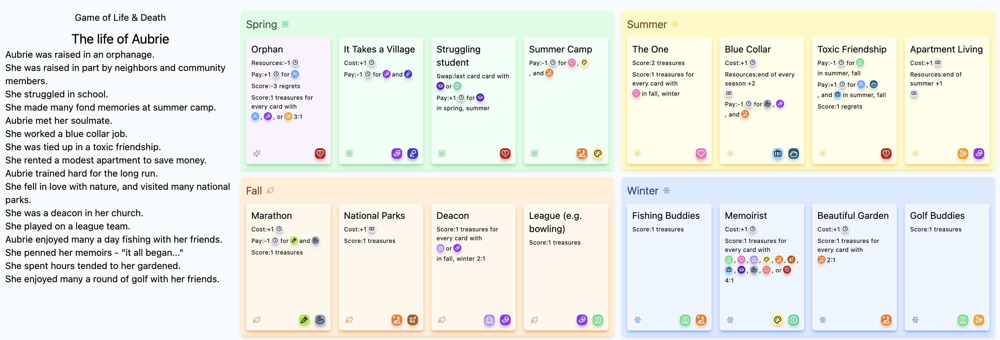

### [Play the beta!](https://animate-object.github.io/gold)
### [Try narrative mode!](https://animate-object.github.io/gold?narrative)

# Game of Life and Death

> I have the nature grow old 
> I have the nature get sick 
> I have the nature die 
> I have the nature to be separated from the ones I love 
> I own only my actions 
> So how then should I live?

A simple card drafting RPG. One is faced, in every season of life, with finite choices and limited resources. Along the way one gathers treasures: grand accomplishments, memories, and deep relationships. When the bell tolls (no one knows when), one hopes to find more treasures than regrets.

## Development notes

### To Do

- theming: 'character creation'
- mechanic: wildcard resource costs(?)
- ui: polish
- ui: card art
- ui: make game end more 'fun'
- gamedev: play testing and refinement

### In progress

### Done

- mechanic: mistakes/fortunes
- mechanic: fate dice
- foundation: design rules for all basic cards
  - in spring
  - in summer
  - in fall
  - in winter
  - fortune deck
- foundation: game end
- ui: basic WIP display
- ui: start rule description system
- foundation: design and implement recurring rules
- foundation: enter basic card information for initial deck
- bug: fix replacement rule mechanic
- foundation: wire in rule engine
- mechanic: beginnings deck
- bug: fix recurring resource rules 
  - (repro steps: older sibling, two matches in spring)
- foundation: decouple current turn from next spot in tableau
  - e.g., replacement card should increment turn but not break placement rules
- foundation: base cost, card cost rules, and draft cost rules
- foundation: resources and card costs
  - done when:
    - playing card draws resources from pool
    - we can detect when you can't buy a card
- foundation: resource exchange
- mechanic: cards that change draft cost
- ui: rule description for cost
- ui: rule description for draft-cost
- foundation: scoring
- ui: rule description for scoring

### Brainstorming

Deck of fortunes

When you run out of resources, you can draw for free from the deck of fortunes.

Fate dice

At the end of every season, and when triggered by certain cards, 'fate dice' are rolled

The most likely outcomes are relatively innocuous, gaining or losing a few resources

Some die rolls force you to play one card from the fortunes deck

Finally, as seasons progress, there is a slight but increasing chance to meet an untimely death

